# Arabic-Sentiment-Analysis
# 📝 Evolving Arabic Sentiment Analysis - Machine Learning-Driven Methodologies

## 📌 Introduction
### **Problem Statement**
Manually analyzing Arabic text reviews is challenging due to:
- The **complexity** of the Arabic language.
- The **high volume** of data in real-world applications.

### **Aim**
To develop an **automated system** using machine learning for efficient sentiment classification of Arabic reviews.

### **Objectives**

✅ **Develop Automation:** Build a system for Arabic sentiment analysis.

✅ **Handle Complexity:** Address linguistic challenges like morphology and text directionality.

✅ **Improve Accuracy:** Apply advanced ML models for better sentiment classification.

✅ **Facilitate Decision-Making:** Provide insights for customer satisfaction improvement.

✅ **Scale Analysis:** Enable efficient processing of large datasets.

---

## 🔄 Sentiment Analysis Pipeline

📌 **Steps:**

1. **Data Acquisition** → Preprocessing → Normalization

2. **Feature Extraction (TF-IDF)** → Tokenization & Stemming → Lemmatization

3. **Feature Classification** → Naive Bayes - Random Forest - Logistic Regression

4. **Model Evaluation** → Handle Imbalanced Data → Performance Metrics

---

## 📂 Data Acquisition

- **Source:** Kaggle

- **Content:** Arabic-language reviews from various companies.

- **Features:**

  - **Review Text:** The main content.

  - **Rating:** Categorized as Positive (1), Neutral (0), Negative (-1).

  - **Company:** The reviewed company.

- **Volume:** 40,046 reviews.

📌 **Word Cloud Analysis**: A visual representation was created to highlight the most common words.

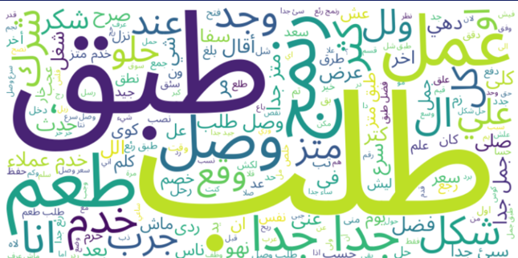

---

## 🔧 Data Preprocessing

✅ **Drop Null Values:** Ensures meaningful data inputs.

✅ **Remove Duplicates:** Reduces bias in training.

✅ **Emoji Removal:** Cleans text for better NLP processing.

✅ **Punctuation & Stop Words Removal:** Enhances feature extraction.

✅ **Tokenization:** Breaks text into meaningful units.

✅ **Normalization (Stemming & Lemmatization):** Simplifies text representation.

---

## 📊 Feature Extraction

✅ **Technique:** TF-IDF Vectorization

✅ **Components:**

- **TF (Term Frequency):** Measures word occurrence.

- **IDF (Inverse Document Frequency):** Highlights rare words.

✅ **Purpose:** Converts textual data into numerical features for ML.

---

## 🤖 Machine Learning Models

Three models were built and evaluated:

1. **Random Forest** - Ensemble method improving accuracy and stability.

2. **Multinomial Naïve Bayes** - Probability-based model for text classification.

3. **Logistic Regression** - Efficient classification with one-vs-rest strategy.

---

## 🔍 Hyperparameter Tuning

✅ **Method Used:** GridSearchCV

✅ **Purpose:** Optimizes model parameters via:

- Systematic Exploration

- Cross-Validation

✅ **Goal:** Improve accuracy and prevent overfitting.

---

## 📈 Performance Metrics

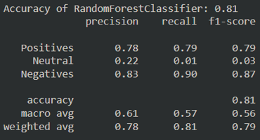

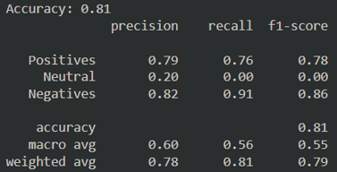

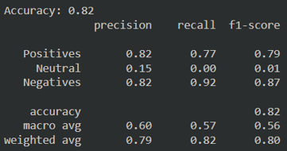

🔴 **Challenge:** Imbalanced dataset affecting classification performance.

📌 **Handling Data Imbalance (SMOTE)**

✅ **Technique Used:** Synthetic Minority Oversampling (SMOTE)

✅ **Effect:**

- Generates synthetic samples for minority classes.

- Balances class distribution for improved performance.

## Performance Metrics After Applying SMOTE

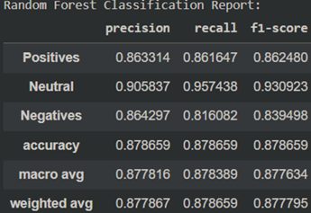

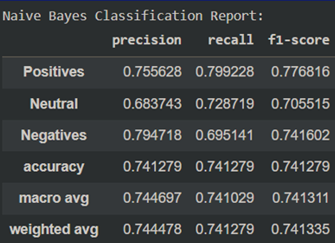

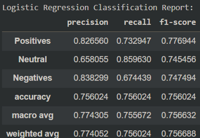

### Confusion Matrix

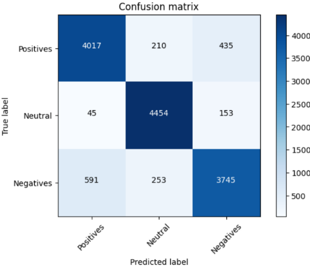

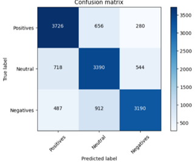

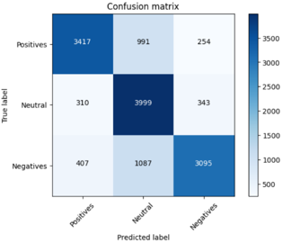

---

## 📊 Visualization of Results

### ROC Curves

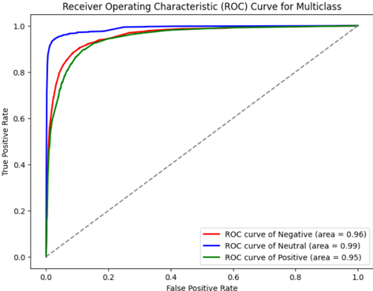

### Training and Validation Error vs. Number of Trees

✅ **Findings:**

- Random Forest outperformed other models with **88% accuracy**.

- SMOTE significantly improved classification balance.

---

## 🎯 Example Predictions

✔️ **Comment:** "وصلني الطعام متأخرا والاكل بارد" → **Predicted Label:** Negative

✔️ **Comment:** "أفضل تطبيق" → **Predicted Label:** Positive

✔️ **Comment:** "مش عارف" → **Predicted Label:** Neutral

---

## 📌 Project Strengths

✅ **High Accuracy:** Achieved **88% accuracy** in sentiment classification.

✅ **Data Imbalance Handling:** SMOTE effectively balanced class distribution.

✅ **Comprehensive Preprocessing:** Extensive NLP techniques improved model performance.

✅ **Visualization Tools:** Word clouds, pie charts, and plots enhanced insights.

---

## ⚠️ Limitations

❌ **Dialectal Variations:** Struggled with diverse Arabic dialects.

❌ **Limited Lexical Resources:** Need for richer Arabic sentiment lexicons.

❌ **Processing Complexity:** Arabic preprocessing added computational cost.

---

### 📬 Contributions & Feedback
Contributions and suggestions for improvements are welcome! 🚀
